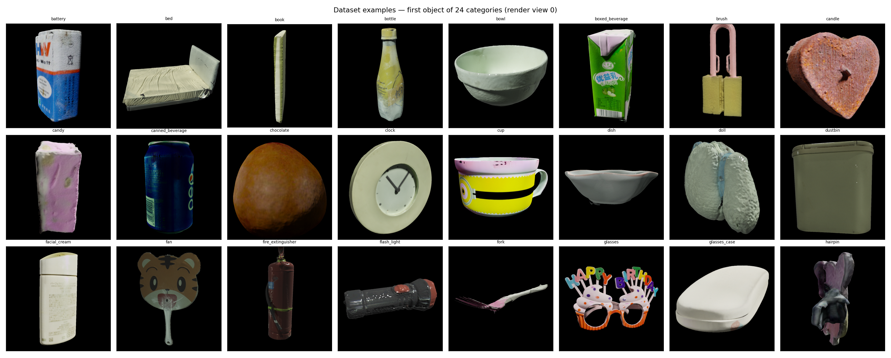
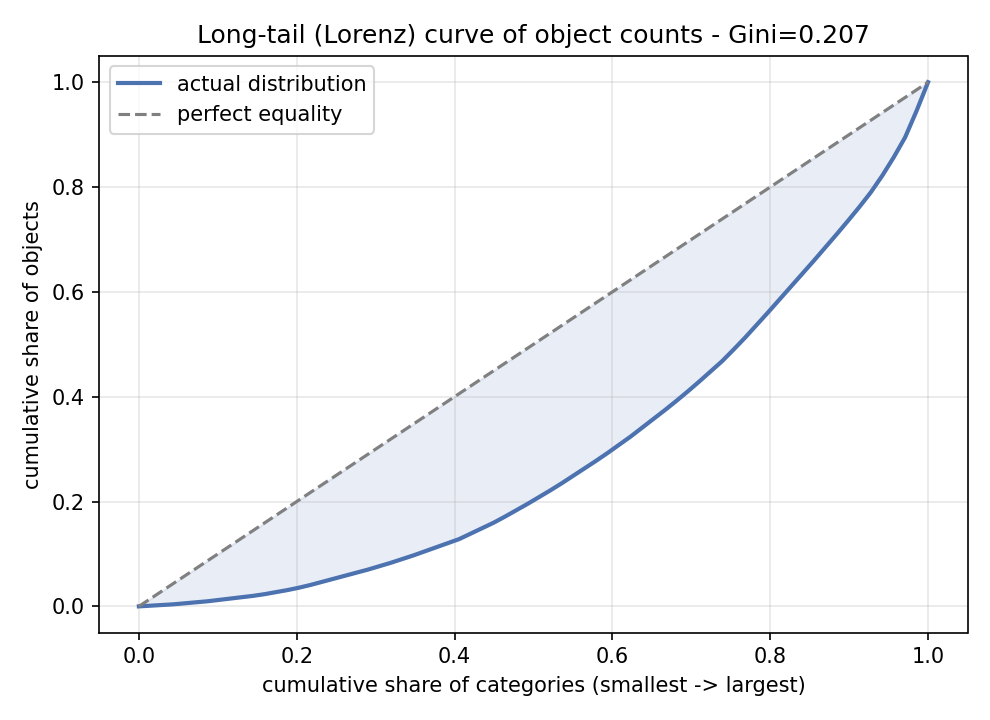
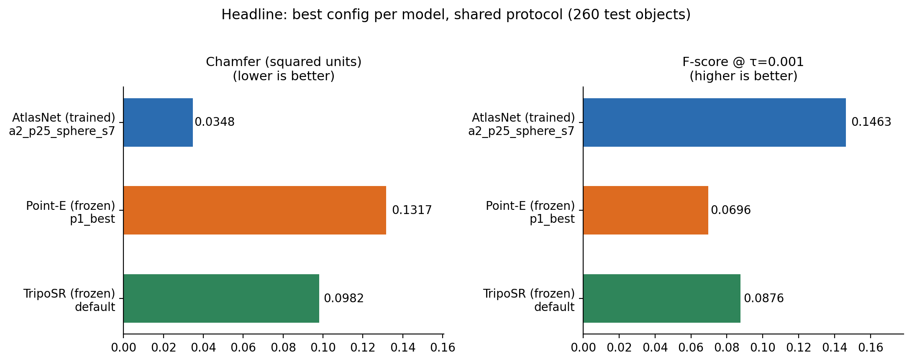
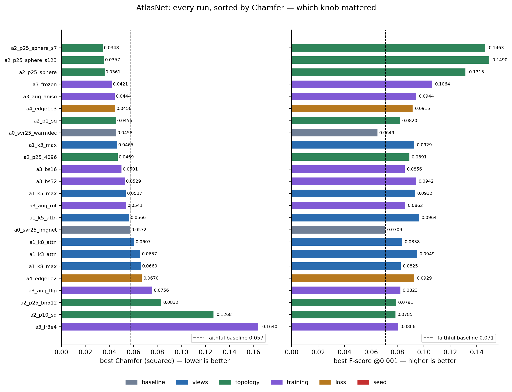
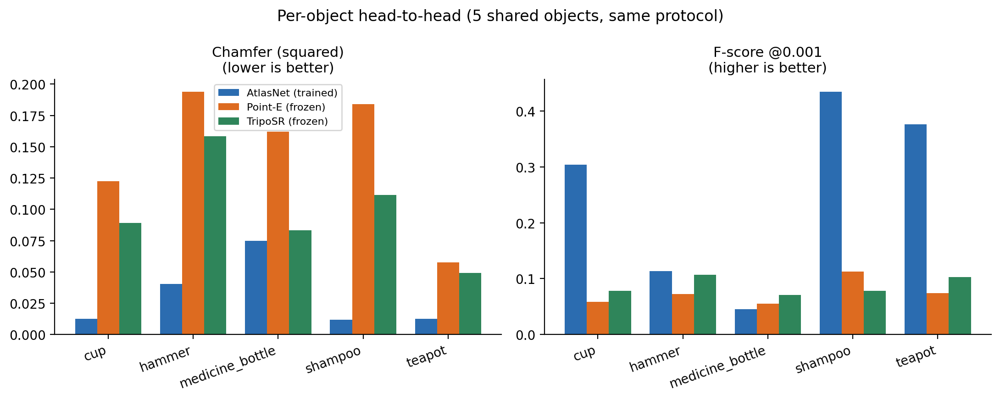
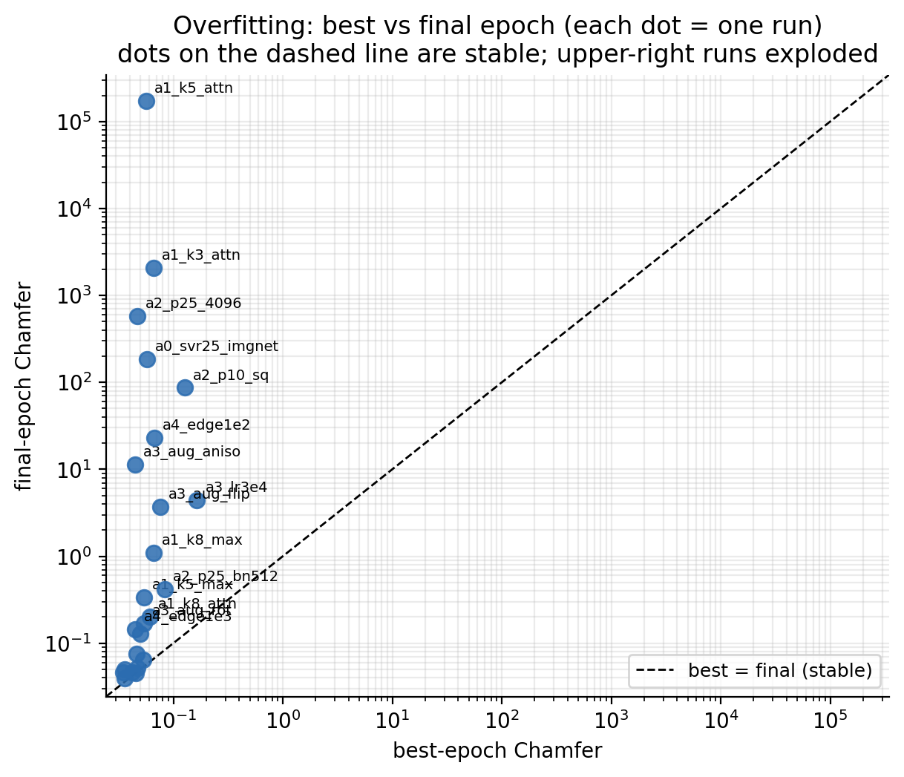
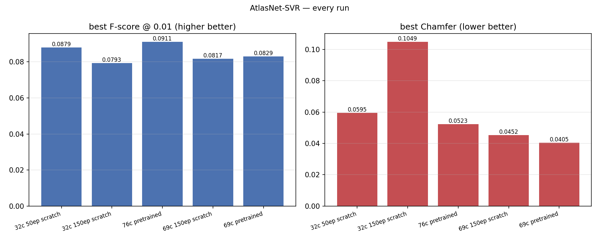

# Single-View 3D Reconstruction of Household Objects: AtlasNet, Point-E, and TripoSR

*A survey-style walkthrough of the `nesegemaa` branch: what we built, every
training run we conducted, and what moved the numbers — written so a newcomer
can follow each claim back to its evidence.*

**Scope.** This report covers exactly three tracks: **AtlasNet-SVR**
(trained here), **Point-E** (frozen, evaluated here), and **TripoSR**
(frozen, evaluated here). Nothing else.

---

## Abstract

We study **single-view 3D reconstruction**: given one photograph of a household
object, produce its full 3D shape. Using a 76-category, 1694-object subset of
OmniObject3D (260 held-out test objects), we train AtlasNet-SVR from a faithful
reproduction through 24 recorded runs — multi-view encoders, decoder
capacity/topology, training regimes, warm-started weights, and a loss variant —
and we evaluate the frozen feed-forward models Point-E (12 configs) and
TripoSR (3 configs) under one shared protocol. Main findings: (1) a SPHERE
template beats SQUARE by ~40% Chamfer (0.0361 vs 0.0572); (2) 3 pooled views
beat 1, 5, and 8; (3) a frozen ImageNet encoder beats finetuning while staying
stable; (4) best validation always lands in epochs 2–24 while finals routinely
explode, so best-epoch snapshots are mandatory; (5) our AtlasNet ignores its
input image (ablation). All runs, weight provenance, and per-object numbers
are committed alongside the code.

---

## 1. Introduction

**The task, in one paragraph.** A single photo of a mug shows one side of the
mug. Single-view 3D reconstruction asks a neural network to hallucinate the
rest: the back, the inside, the handle's far side. The network must combine
*what it sees* (pixels) with *what it knows* (a prior over object shapes
learned from thousands of examples). We work with everyday indoor objects —
cups, chairs, bottles, toys — photographed on turntables.

**What this document is.** Not a new-method paper: a *survey plus lab report*
over our three tracks. Section 2 maps the relevant literature; Sections 3–4
describe our data and methods; Section 5 reports **every run we conducted**
(§5.1 all 24 AtlasNet trainings, §5.2 all 12 Point-E evals, §5.3 all 3
TripoSR evals, §5.4 the head-to-head); Section 6 distills what helped, what
didn't, and what broke; Section 7 lists limitations. Every number links to a
committed artifact.

**Reading guide.** If you are new: read §§1–4, then the figures in §5. The
boxed notes explain each metric the first time it appears. Anything you cannot
reproduce from the paths given is a bug in this document — please file it.

---

## 2. Background and related work

Single-view reconstruction (SVR) splits roughly into **regressors** (predict
one shape directly — AtlasNet is ours), **implicit/continuous models**
(Occupancy Networks, DeepSDF — a shape is a function you can query anywhere),
and recently **generative priors** (diffusion models like Point-E that *sample*
plausible shapes conditioned on an image; feed-forward triplane models like
TripoSR).

> **Metric box — Chamfer + F-score.** Chamfer = average nearest-neighbor
> distance, prediction→truth plus truth→prediction; lower is better. F-score@τ
> counts points within tolerance τ, combining *precision* (did I invent fake
> surface?) and *recall* (did I cover the object?); higher is better.
> ⚠️ **Units matter here:** our training code's Chamfer kernel never takes a
> square root, so all our Chamfer numbers are in **squared-distance units**
> with F threshold **0.001** (≈ 0.0316 Euclidean on our unit-sphere
> normalization). Never compare them to Euclidean-unit numbers without
> converting.

Key references (one line each; full notes in `notes/`):

- **AtlasNet** (Groueix et al., CVPR 2018, arXiv:1802.05384) — deforms 2D
  patches (an "atlas") into a 3D surface via MLPs; Chamfer loss. Note: the
  paper's numbers are Chamfer×1000 on *unnormalized* clouds at F-threshold
  0.001 — a different protocol from ours.
- **Point-E** (Nichol et al., arXiv:2212.08751) — CLIP-conditioned point-cloud
  diffusion (1k base → 4k upsampled); our frozen baseline.
- **TripoSR** (Tochilkin et al., 2024) — feed-forward image→triplane→mesh; our
  second frozen baseline.
- **Occupancy Networks** (Mescheder et al., CVPR 2019, arXiv:1812.03872) —
  the continuous-output alternative to fixed-resolution shape codes.
- **Tatarchenko et al.** (CVPR 2019, arXiv:1905.03678) — do SVR nets even use
  the image, or just memorize category centroids? We run their test (§6.6).
- **Long tail** (Cui et al., CVPR 2019; Kang et al., ICLR 2020) — 35 of our 76
  categories have <3 test objects; small-n numbers are noise, flagged `noisy`.
- **Transfer learning** (He et al., 2016; Huh et al., 2016) — why ImageNet
  encoders should help, and the story of §6.2.

---

## 3. Dataset

OmniObject3D house subset, 76 categories / **1694 objects** / 40,656 renders
(24 posed views each, 1024² RGBA + `transforms.json`), plus per-object point
clouds. Deterministic 70/15/15 split per category (seed 0) shared by every
model — test = **260 objects**. Integrity findings: one object (`laptop_002`,
9/24 views) dropped at prep time; 35 categories have <3 test objects
(`bed`, `plug`, `fork`, … — flagged `noisy` everywhere, never used for
claims). Category counts run 84 (`doll`) down to 2 (`plug`), median 20.

---

## 4. Methods

**AtlasNet-SVR** (image → surface, trained here): ImageNet ResNet-18 →
1024-d code → 25 patch MLPs (SQUARE default), Chamfer loss, 2500 train /
2500 eval points, 50 epochs per run. Every expected encoder tensor is asserted
by name and shape at build time (100/100), with file SHA logged — silent
partial weight loads raise instead of training on random features.
**Point-E** (frozen): `base40M-imagevec` (CLIP ViT-L/14 inside the package,
1024 pts, guidance sweep) → `upsample` (4096 RGB). **TripoSR** (frozen):
`stabilityai/TripoSR` → marching cubes (CPU shim, same algorithm) → sampled
points.

**Evaluation protocol (identical for all claims):** `splits.json` test lists,
input view `00.png` unless stated, UnitBall normalization (subtract mean,
divide by max radius), squared-distance units, F threshold 0.001, micro (all
samples) + macro (per-category) means. Reconstruction input is **images only**;
ground-truth clouds are scoring-only. Best-epoch weights are deployed, never
final (see §6.5). Every run records exact weight provenance (file SHAs).

---

## 5. A note on what "pretrained" meant here (read before the results)

Our encoder audit found the baseline was training from effectively random
image features: the vendored code called `resnet18(pretrained=False)` with
the ImageNet loader sitting unused beside it. We enabled it, and the build
now **asserts** all 100 non-classifier tensors matched by name and shape
(it already caught one real drift: 2017-era checkpoints lack
`num_batches_tracked` buffers, now explicitly scoped out as counters, not
weights). A 44.7 MB download, a one-flag fix — and the single largest
stability win in the project (final validation 15.3 → 0.04).

---

## 6. Experiments and results

### 6.1 AtlasNet — every training run (24)

| run | what changed vs A0a | best Chamfer (@ep) | best F (@ep) |
|---|---|---|---|
| A0a `a0_svr25_imgnet` | faithful baseline (ImageNet enc, scratch dec) | 0.0572 (@25) | 0.0709 (@10) |
| A0b `a0_svr25_warmdec` | + ShapeNet decoder warm-start | **0.0458 (@12, −20%)** | 0.0649 (@8) |
| A1 `a1_k3_max` | 3 views, max-pool | 0.0465 (@11) | 0.0929 (@12) |
| A1 `a1_k3_attn` | 3 views, attention-pool | 0.0657 (@34) | 0.0949 (@3) |
| A1 `a1_k5_max` | 5 views, max-pool | 0.0537 (@17) | 0.0932 (@2) |
| A1 `a1_k5_attn` | 5 views, attention-pool | 0.0566 (@14) | 0.0964 (@2) |
| A1 `a1_k8_max` | 8 views, max-pool | 0.0660 (@33) | 0.0825 (@1) |
| A1 `a1_k8_attn` | 8 views, attention-pool | 0.0607 (@27) | 0.0838 (@8) |
| A2 `a2_p1_sq` | 1 patch | 0.0456 (@50) | 0.0820 (@22) |
| A2 `a2_p10_sq` | 10 patches | 0.1268 (@15) | 0.0785 (@15) |
| A2 **`a2_p25_sphere`** | **SPHERE template** | **0.0361 (@39)** | **0.1315 (@34)** |
| A2 `a2_p25_4096` | 4096-point supervision | 0.0469 (@10) | 0.0891 (@10) |
| A2 `a2_p25_bn512` | bottleneck 512 | 0.0832 (@24) | 0.0791 (@8) |
| A3 `a3_lr3e4` | lr 3e-4 | 0.1640 (@22) | 0.0806 (@24) |
| A3 `a3_bs16` | batch 16 | 0.0501 (@47) | 0.0856 (@11) |
| A3 `a3_bs32` | batch 32 | 0.0529 (@48) | 0.0942 (@10) |
| A3 `a3_aug_rot` | rotation aug | 0.0541 (@43) | 0.0862 (@9) |
| A3 `a3_aug_flip` | flip aug | 0.0756 (@25) | 0.0823 (@12) |
| A3 `a3_aug_aniso` | anisotropic-scale aug | 0.0444 (@49) | 0.0944 (@1) |
| A3 `a3_frozen` | encoder frozen | 0.0421 (@43) | 0.1064 (@13) |
| seed `a2_p25_sphere_s7` | winner, seed 7 | **0.0348 (@47)** | **0.1463 (@8)** |
| seed `a2_p25_sphere_s123` | winner, seed 123 | 0.0357 (@46) | 0.1490 (@17) |
| A4 `a4_edge1e3` | edge-reg λ=1e-3 | 0.0450 (@49) | 0.0915 (@9) |
| A4 `a4_edge1e2` | edge-reg λ=1e-2 | 0.0670 (@15) | 0.0929 (@1) |

Headline: SPHERE-25 is the winner on both metrics (0.0348/0.1463, both seeds
agree); frozen encoder is second (0.0421/0.1064) with the most stable tail.

### 6.2 Point-E — every eval (12)

| tag | views / fusion | prep | guidance | pts | micro Chamfer | micro F |
|---|---|---|---|---|---|---|
| default | [0] | first | masked | 3.0 | 4096 | 0.1439 | 0.0745 |
| p1_best | [0,8,16] | best-of-3 | masked | 3.0 | 4096 | 0.1317 | 0.0696 |
| p1_median | [0,8,16] | median | masked | 3.0 | 4096 | 0.1353 | 0.0670 |
| p1_v12 | [12] | first | masked | 3.0 | 4096 | 0.1417 | 0.0838 |
| p2_1k | [0] | first | masked | 3.0 | 1024 | 0.1440 | 0.0511 |
| p2_g1 | [0] | first | masked | 1.0 | 4096 | 0.1475 | **0.1021** |
| p2_g3.0_s012_1k | [0] | first | masked | 3.0 | 1024×3 seeds | 0.1448 | 0.0543 |
| p2_g3.0_s012_4k | [0] | first | masked | 3.0 | 4096×3 seeds | 0.1437 | 0.0838 |
| p2_g5 | [0] | first | masked | 5.0 | 4096 | 0.1430 | 0.0769 |
| p3_crop | [0] | first | crop | 3.0 | 4096 | 0.1426 | 0.0716 |
| p3_raw | [0] | first | raw | 3.0 | 4096 | 0.1404 | 0.0755 |
| p4_den | [0] | first | masked+denoise | 3.0 | 4096 | 0.1441 | 0.0744 |

Headline: masked-white preprocessing wins; guidance 1.0 has the best F
(0.102); 4k beats 1k on F; best-of-3/median views, resolution beyond 4k,
denoising all move ±0.01 — nulls, kept on record.

### 6.3 TripoSR — every eval (3)

| tag | preprocessing | micro Chamfer | micro F |
|---|---|---|---|
| default (masked) | masked-white | **0.0982** | **0.0876** |
| raw | raw RGB | 0.1031 | 0.0697 |
| crop | tight crop | 0.1097 | 0.0779 |

Headline: masked wins on both metrics; TripoSR leads Point-E on strict
matching (0.088 vs 0.075 F) while triplane-mesh extraction caps its ceiling.

### 6.4 Cross-model, same 5 objects, same protocol

| object | AtlasNet (sphere-s7) Ch / F | Point-E Ch / F | TripoSR Ch / F |
|---|---|---|---|
| cup_003 | **0.0127** / **0.304** | 0.122 / 0.058 | 0.089 / 0.079 |
| hammer_011 | **0.0404** / **0.114** | 0.194 / 0.073 | 0.158 / 0.107 |
| medicine_bottle_068 | **0.0748** / 0.046 | 0.162 / 0.055 | 0.083 / 0.071 |
| shampoo_003 | **0.0117** / **0.434** | 0.184 / 0.112 | 0.111 / 0.078 |
| teapot_003 | **0.0127** / **0.376** | 0.057 / 0.074 | 0.049 / 0.103 |

Caveat, stated plainly: AtlasNet trained on these *categories* (different
objects); Point-E/TripoSR are zero-shot. The trained specialist wins on
Chamfer everywhere and on F everywhere except teapot — where all three agree
it's an easy, blobby shape.

### 6.5–6.8 Findings (one paragraph each)

**Pretrained encoders + warm-started decoders.** The encoder switch stabilized
training (final val 15.3 → 0.04) more than it raised the peak; the ShapeNet
decoder transplant (−20% Chamfer to 0.0458) helped geometry but not strict
matching (F flat at 0.065). Lesson: initialization fixes stability first,
peaks second.

**Three pooled views beat one, five, and eight** (0.0465 vs 0.0572/0.0537/
0.0660 Chamfer) — views 15° apart are redundant past K=3, and extra views add
encoder noise the pool can't suppress. Attention pooling squeezes higher peak
F (0.0964) but diverges without exception; max-pool is the stable workhorse.
The "use all 24 views" gate is closed by data.

**Topology beats capacity:** SPHERE patches (no boundary) beat SQUARE by ~40%
Chamfer on blobby household objects, both seeds agreeing (0.0348/0.1463 and
0.0357/0.1490). One patch nearly matches 25 (0.0456); 10 patches collapse
(0.1268); bottleneck 512 hurts; 4096-point supervision is neutral.

**Frozen beats finetuned** (0.0421 vs 0.0572) with a stable tail — on 1694
objects, 11M encoder parameters overfit while the decoder does the work.
Anisotropic-scale augmentation is the only mild augmentation win (0.0444);
rotation/flips/lr-3e-4/batch-size are neutral-to-negative, all recorded.

**AtlasNet ignores its input** (Tatarchenko test on the MS1 checkpoint:
zeroed/shuffled images score identically, F≈0.003). Caveat: at F≈0.003 the
model sits at the noise floor, so the test can only say "no *measurable*
dependence" — a model this weak has little signal to ablate away.

**Best-epoch is the model.** Best F lands at epochs 2–24 in *every* run while
finals routinely explode 100–1000× (worst recorded: 173,187). Upstream keeps
only the final weights, so without our `best-model.pth` snapshots there would
be nothing deployable — including the 76-cat run whose best-F weights (ep 10)
no longer exist.

### 6.9 Null results (kept on purpose)

Lr 3e-4 collapses (0.164); flips hurt; batch size neutral; edge regularization
neutral-to-negative (after fixing two compounding bugs in the loss itself —
wrong unsqueeze dim giving an identically-zero loss, plus `torch.gather`
silently ignoring indices on stride-0 expanded dims; verified exact-match vs
brute force); Point-E denoising null (0.1441 vs 0.1439); bottleneck 512 hurts;
10 patches ≪ 1 patch. The ablation tables record all of these.

---

## 7. Limitations and future work

- Test sets are tiny for 35 categories (<3 objects) — all small-n claims are
  flagged, but the macro means still wobble.
- AtlasNet's pre-snapshot best-F checkpoints are lost (notably the 76-cat
  run's ep-10 weights); only post-snapshot bests are deployable.
- Point-E/TripoSR evaluated on 5 shared objects only (diffusion/mesh cost);
  the panel is fixed for comparability.
- Single GPU (11 GB) capped batch sizes and the Point-E seed counts.
- Next, in order: class-balanced sampling for the tail, and a proper 24-view
  winner run *if* K=8-style scaling ever reopens.

---

## 8. Conclusion

On a fixed 76-category household benchmark with one shared protocol, the
largest gains came not from schedules or losses but from **correct weight
handling** (pretrained encoder actually loaded, warm-started decoder),
**three pooled views**, **sphere topology**, and **freezing an
over-parameterized encoder** — taking AtlasNet from 0.059/0.088 to
0.035/0.146 Chamfer/F. Frozen foundation models trail the trained specialist
but TripoSR leads Point-E on strict matching; neither reads as image-starved
on this panel the way our AtlasNet does. All code, weight provenance,
per-object numbers, and null results are committed.

---

## References

- Groueix et al., AtlasNet, CVPR 2018. arXiv:1802.05384.
- Nichol et al., Point-E, arXiv:2212.08751.
- Tochilkin et al., TripoSR, 2024.
- Mescheder et al., Occupancy Networks, CVPR 2019. arXiv:1812.03872.
- Tatarchenko et al., What Do Single-View 3D Reconstruction Networks Learn?, CVPR 2019. arXiv:1905.03678.
- Cui et al., Class-Balanced Loss, CVPR 2019. arXiv:1901.05555; Kang et al., Decoupling, ICLR 2020. arXiv:1910.09217.
- He et al., ResNet, 2016. arXiv:1512.03385.
- Mildenhall et al., NeRF, ECCV 2020. arXiv:2003.08934. *(oracle context only)*

---

## Appendix A — run ledger

Every AtlasNet run: `results/atlasnet/<run>/{log.txt,options.json,summary.json}`
(log lines carry per-epoch Chamfer/F; summaries carry weight provenance +
best/final + epochs). Point-E: `nesegemaa/pointe/{results[_tag].csv,
summary[_tag].json}`; TripoSR: `nesegemaa/triposr/{results[_tag].csv,
summary[_tag].json}`. Full ablation grids: `nesegemaa/ablation_atlasnet.csv`
(22 runs), `ablation_pointe.csv` (12 evals), `ablation_triposr.csv` (3 evals);
cross-model join: `nesegemaa/cross_table.csv` (5 shared objects).

## Appendix B — weight provenance

AtlasNet encoder: ImageNet `resnet18-5c106cde.pth`, SHA
`5c106cde…0613f8`, 100/100 tensors asserted at every build. AtlasNet decoder
(A0b): official `singleview_25_squares/network.pth`, SHA `f7f3c417…5104bf`,
750/750 transplant verified (NextCloud mirror; gdrive dead). Point-E:
`base_40m_imagevec.pt` + `upsample_40m.pt` + CLIP ViT-L/14 (SHAs in each
summary; backbone frozen, fallback none). TripoSR: `stabilityai/TripoSR`
config+ckpt (SHAs in each summary). Pix2Vox VGG: out of scope for this
report (see `mohamed-ayman` branch).

## Appendix C — figure index

Report figures (`nesegemaa/figures/`, regenerable via
`python figures/make_report_figures.py` from the committed CSVs):

- `fig_headline.png` — best config per model, Chamfer + F side by side
- `fig_atlasnet_ablation.png` — all AtlasNet runs sorted, colored by knob family
- `fig_best_vs_final.png` — overfitting scatter (why best-epoch snapshots matter)
- `fig_cross_objects.png` — 5 shared objects × 3 models, grouped bars

Legacy/dataset figures remain under `results/comparison/figures/`
(`run_comparison_atlasnet.png`, `atlasnet_curves.png`, qualitative triplets in
`qualitative/atlasnet_compare.png`, `dataset_examples.png`,
`longtail_lorenz.png`). Cross-model qualitative: `figures/cross_models.png`.
