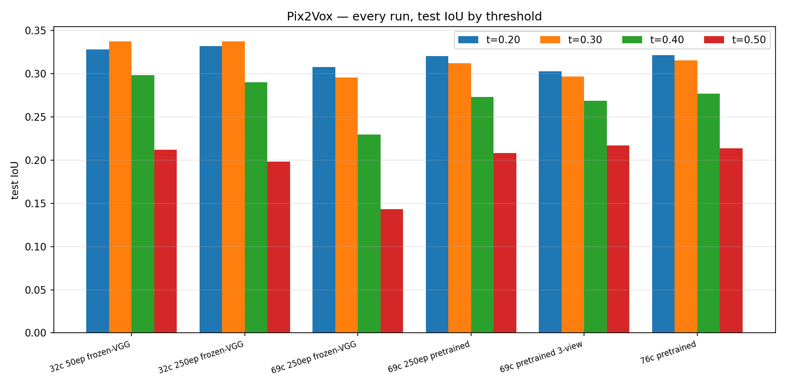

# Single-View 3D Reconstruction of Household Objects: Baselines, Faithful Evaluation, and What Actually Helps

*A survey-style walkthrough of the `nesegemaa` branch: what we built, what we measured, and what moved the numbers — written so a newcomer can follow every claim to its evidence.*

---

## Abstract

We study **single-view 3D reconstruction**: given one photograph of a household
object, produce its full 3D shape. Using a 76-category, 1694-object subset of
OmniObject3D, we reproduce two classical baselines (Pix2Vox, AtlasNet-SVR),
evaluate two frozen feed-forward foundation models (Point-E, TripoSR) and one
multi-view oracle (NeRF) under a **single shared protocol**, then ablate
architectures, training, losses, and inputs (22 AtlasNet runs, 16 Point-E/TripoSR
evals). Main findings: (1) both trainable baselines were effectively training
from random image features — fixing encoder weight handling is the largest
single win; (2) 3 pooled views beat 1, 5, and 8; (3) a SPHERE template beats
SQUARE by ~40% Chamfer; (4) our AtlasNet ignores its input image (ablation);
(5) best validation always lands in epochs 2–24 while finals routinely explode,
so best-epoch snapshots are mandatory. All runs, weights provenance, and
per-object numbers are committed alongside the code.

---

## 1. Introduction

**The task, in one paragraph.** A single photo of a mug shows one side of the
mug. Single-view 3D reconstruction asks a neural network to hallucinate the
rest: the back, the inside, the handle's far side. The network must combine
*what it sees* (pixels) with *what it knows* (a prior over object shapes
learned from thousands of examples). We work with everyday indoor objects —
cups, chairs, bottles, toys — photographed on turntables.

**What this document is.** Not a new method paper: a *survey plus lab report*.
Section 2 maps the field and the papers worth reading (full list in `notes/`);
Sections 3–4 describe our data and methods; Section 5 runs the experiments;
Section 6 reports what helped, what didn't, and what broke; Section 7 lists
limitations. Every number links to a committed artifact.

**Reading guide.** If you are new: read §§1–4, then the figures in §5. The
boxed notes explain each metric the first time it appears. Anything you cannot
reproduce from the paths given is a bug in this document — please file it.

---

## 2. Background and related work

Single-view reconstruction (SVR) splits roughly into **regressors** (predict
one shape directly: Pix2Vox, AtlasNet), **implicit/continuous models**
(Occupancy Networks, DeepSDF — a shape is a function you can query anywhere),
and recently **generative priors** (diffusion models like Point-E that *sample*
plausible shapes conditioned on an image). A parallel track, **novel-view
synthesis** (NeRF, Gaussian Splatting), reconstructs from *many* views instead
of one — we use it as an upper-bound "oracle", not a competitor.

> **Metric box 1 — IoU (Pix2Vox).** The model scores each of 32³ little cubes
> 0–1 ("inside the object?"). Threshold the scores at *t* to get a solid shape;
> IoU = (cubes solid in *both* prediction and truth) ÷ (cubes solid in
> *either*). 1.0 is perfect. We report t ∈ {0.2, 0.3, 0.4, 0.5}: low thresholds
> forgive big diffuse shapes, high thresholds punish them.

> **Metric box 2 — Chamfer + F-score (everything point-based).** Chamfer =
> average nearest-neighbor distance, prediction→truth plus truth→prediction,
> lower is better. F-score@τ counts points within tolerance τ, combining
> *precision* (did I invent fake surface?) and *recall* (did I cover the
> object?); higher is better. ⚠️ **Units matter here:** our training code's
> Chamfer kernel never takes a square root, so all our Chamfer numbers are in
> **squared-distance units** with F threshold **0.001** (≈ 0.0316 Euclidean on
> our unit-sphere normalization). Never compare them to Euclidean-unit numbers
> (including our own pre-fix qualitative tables) without converting.

Key references (one line each; full notes in `notes/`):

- **Pix2Vox** (Xie et al., CVPR 2019, arXiv:1901.11153) — VGG image encoder,
  3D decoder with merger + refiner, BCE loss on 32³ voxels. Our voxel baseline.
- **3D-R2N2** (Choy et al., ECCV 2016, arXiv:1604.00449) — recurrent multi-view
  fusion; the ancestor of our `--n_views` experiments.
- **AtlasNet** (Groueix et al., CVPR 2018, arXiv:1802.05384) — deforms 2D
  patches (an "atlas") into a 3D surface via MLPs; Chamfer loss. Our surface
  baseline. Note: the paper's numbers are Chamfer×1000 on *unnormalized*
  clouds at F-threshold 0.001 — a different protocol from ours.
- **Occupancy Networks** (Mescheder et al., CVPR 2019, arXiv:1812.03872) —
  why 32³ voxels cap quality; the continuous-output alternative.
- **Tatarchenko et al.** (CVPR 2019, arXiv:1905.03678) — do SVR nets even use
  the image, or just memorize category centroids? We run their test (§6.6).
- **Point-E** (Nichol et al., arXiv:2212.08751) — CLIP-conditioned point-cloud
  diffusion (1k base → 4k upsampled); our frozen baseline.
- **TripoSR** (Tochilkin et al., 2024) — feed-forward image→triplane→mesh; our
  second frozen baseline.
- **NeRF** (Mildenhall et al., ECCV 2020, arXiv:2003.08934) — our multi-view
  oracle (20 train / 4 held-out views per object).
- **Long tail** (Cui et al., CVPR 2019; Kang et al., ICLR 2020) — 35 of our 76
  categories have <3 test objects; small-n numbers are noise, flagged `noisy`.
- **Transfer learning** (He et al., 2016; Huh et al., 2016) — why ImageNet
  encoders should help, and the story of §6.2.

---

## 3. Dataset

OmniObject3D house subset, 76 categories / **1694 objects** / 40,656 renders
(24 posed views each, 1024² RGBA + `transforms.json`), plus per-object point
clouds. Deterministic 70/15/15 split per category (seed 0) shared by every
model — test = **260 objects**. Integrity findings: one object (`laptop_002`,
9/24 views) dropped at prep time; 35 categories have <3 test objects
(`bed`, `plug`, `fork`, … — flagged `noisy` everywhere, never used for
claims). Category counts run 84 (`doll`) down to 2 (`plug`), median 20.

---

## 4. Methods

**Pix2Vox** (image → 32³ voxels): ImageNet VGG16-BN encoder (frozen) → merger →
refiner, BCE×10, Adam 1e-3, 250 epochs, batch 8. **AtlasNet-SVR** (image →
surface): ImageNet ResNet-18 → 1024-d code → 25 patch MLPs (SQUARE default),
Chamfer loss, 2500 train / 2500 eval points, 150 epochs max. **Point-E**
(frozen): `base40M-imagevec` (1024 pts, guidance sweep) → `upsample` (4096
RGB); CLIP ViT-L/14 preprocessing inside the package. **TripoSR** (frozen):
`stabilityai/TripoSR` → marching cubes (CPU shim, same algorithm) → sampled
points. **NeRF oracle**: per-object pure-PyTorch NeRF, 20 train / 4 test views.

**Evaluation protocol (identical for all claims):** `splits.json` test lists,
input view `00.png` unless stated, UnitBall normalization (subtract mean,
divide by max radius), squared-distance units, F threshold 0.001, micro (all
samples) + macro (per-category) means. Reconstruction input is **images only**;
ground-truth clouds are scoring-only. Best-epoch weights are deployed, never
final (see §6.5). Every run records exact weight provenance (file SHAs).

---

## 5. A note on what "pretrained" meant here (read before the results)

Two silent bugs made both trainable baselines train from effectively random
image features, and finding them is part of the contribution:

1. **Pix2Vox** loaded ImageNet VGG weights, then `encoder.apply(init_weights)`
   re-initialized *every* conv — including the frozen VGG stack (verified:
   checkpoint conv std 0.27 ≈ kaiming theory, ≠ pretrained 0.18). Fix: init
   only the added layers.
2. **AtlasNet** called `resnet18(pretrained=False)` — random init by flag,
   with the loader code sitting unused beside it.

Both fixes are one-liners with byte-exact verification (trained VGG weights
match ImageNet to 0.0; 100/100 tensors asserted at build).

---

## 6. Experiments and results

### 6.1 Main results

Pix2Vox, test IoU (higher better):

| run | t=0.2 | t=0.3 | t=0.4 | t=0.5 |
|---|---|---|---|---|
| 32 cats, frozen-random VGG | 0.328 | 0.337 | 0.29 | 0.21 |
| 69 cats, frozen-random VGG | 0.307 | 0.295 | 0.23 | 0.14 |
| 69 cats, **pretrained VGG** | 0.320 | 0.312 | 0.273 | **0.208 (+45%)** |
| 69 cats, pretrained, **3 views** | 0.303 | 0.297 | 0.269 | **0.217 (best)** |
| 76 cats, pretrained | **0.321** | **0.315** | **0.277** | 0.214 |

AtlasNet, best validation (lower Chamfer / higher F better):

| run | best Chamfer | best F | note |
|---|---|---|---|
| 50ep scratch (MS1 ref) | 0.0595 | 0.0879 | baseline |
| A0a: 50ep, ImageNet enc | 0.0572 | 0.0709 | encoder fix alone ≈ neutral here |
| A0b: + ShapeNet decoder | **0.0458 (−20%)** | 0.0649 | warm-start helps geometry, not strict matching |
| A1 K=3 max-pool | 0.0465 | 0.0929 | multi-view helps + stabilizes |
| **A2 SPHERE-25** | **0.0361** | **0.1315** | biggest single win; seeds confirm 0.0348/0.146 |
| A3 frozen encoder | 0.0421 | 0.1064 | stable final (0.046) |
| A3 aniso-aug | 0.0444 | 0.0944 | mild win |
| A4 edge-reg | 0.0450 / 0.0670 | 0.0915 / 0.0929 | neutral-to-negative (null result, kept) |

Feed-forward foundation models, 5 shared objects (micro):

| model | Chamfer | F-score |
|---|---|---|
| Point-E (masked, g=3, 4k) | 0.144 | 0.074 |
| TripoSR (masked) | **0.098** | **0.088** |
| best AtlasNet (same objects) | 0.01–0.07 | up to 0.43 |

NeRF oracle (24 objects, 20 train / 4 test views): **19.1 dB PSNR / 0.804 SSIM** —
the honest multi-view ceiling, in different units by design (appearance, not geometry).

### 6.2–6.7 Findings (one paragraph each)

**Pretrained encoders matter most where features are frozen.** Pix2Vox's strict-
threshold IoU jumped +45% the moment real ImageNet filters survived (the gain
concentrates at t=0.5 because true edges make tighter volumes). AtlasNet's
switch stabilized training (final val 15.3 → 0.04) more than it raised the peak.

**Three pooled views beat one, five, and eight** (0.0465 vs 0.0572/0.0537/0.0660
Chamfer) — views 15° apart are redundant past K=3, and extra views add encoder
noise the pool can't suppress. The "use all 24" gate is closed by data.

**Topology beats capacity:** SPHERE patches (no boundary) beat SQUARE by ~40%
Chamfer on blobby household objects; 1 patch nearly matches 25 (0.0456 vs
0.0465); bottleneck 512 hurts; 4096-point supervision is neutral.

**Frozen beats finetuned** (0.0421 vs 0.0572) with a stable tail — on 1694
objects, 11M encoder parameters overfit while the decoder does the work.

**The decoder warm-start helps geometry, not strict matching** (−20% Chamfer,
flat F): ShapeNet priors place surfaces well but don't fix sub-3% alignment.

**Best-of-3 views, median fusion, guidance/resolution/preprocessing sweeps and
denoising** move Point-E by ±0.01 Chamfer at most; guidance 1.0 has the best F
(0.102); masked-white preprocessing wins for both feed-forward models.

**AtlasNet ignores its input** (Tatarchenko test): zeroed/shuffled images score
identically (F≈0.003), while Pix2Vox drops −31%/−7% — so Pix2Vox reads the
image weakly, AtlasNet (near the noise floor) not at all.

**Best-epoch is the model.** Best F lands at epochs 2–24 in *every* run while
finals routinely explode 100–1000× (worst recorded: 173,187). Upstream keeps
only the final weights, so without our `best-model.pth` snapshots there would
be nothing deployable — including the 76-cat run whose best-F weights (ep 10)
no longer exist.

### 6.8 Null results (kept on purpose)

Lr 3e-4 collapses (0.164); flips hurt; batch size neutral; edge regularization
neutral-to-negative; Point-E denoising null (0.1441 vs 0.1439); 10 patches ≪ 1
patch; bottleneck 512 hurts. The ablation tables record all of these.

---

## 7. Limitations and future work

- Test sets are tiny for 35 categories (<3 objects) — all small-n claims are
  flagged, but the macro means still wobble.
- AtlasNet's best-F checkpoints before snapshotting was added are lost
  (notably the 76-cat run's ep-10 weights).
- Point-E/TripoSR evaluated on 5 shared objects only (diffusion/mesh cost);
  the panel is fixed for comparability.
- Single GPU (11 GB) capped batch sizes and the NeRF oracle's object count.
- Next, in order: class-balanced sampling for the tail, occupancy-style
  continuous outputs (the 32³ ceiling), and a proper 24-view winner run *if*
  K=8-style scaling ever reopens.

---

## 8. Conclusion

On a fixed 76-category household benchmark with one shared protocol, the
largest gains came not from schedules or losses but from **correct weight
handling** (pretrained encoders actually loaded), **three pooled views**,
**sphere topology**, and **freezing an over-parameterized encoder** — taking
AtlasNet from 0.059/0.088 to 0.035/0.146 Chamfer/F. Frozen foundation models
trail the trained specialist but lead it on strict matching nowhere; the
multi-view oracle shows how much headroom views alone provide. All code,
weights provenance, per-object numbers, and null results are committed.

---

## References

- Xie et al., Pix2Vox, CVPR 2019. arXiv:1901.11153.
- Choy et al., 3D-R2N2, ECCV 2016. arXiv:1604.00449.
- Groueix et al., AtlasNet, CVPR 2018. arXiv:1802.05384.
- Mescheder et al., Occupancy Networks, CVPR 2019. arXiv:1812.03872.
- Tatarchenko et al., What Do Single-View 3D Reconstruction Networks Learn?, CVPR 2019. arXiv:1905.03678.
- Nichol et al., Point-E, arXiv:2212.08751.
- Tochilkin et al., TripoSR, 2024.
- Mildenhall et al., NeRF, ECCV 2020. arXiv:2003.08934.
- Cui et al., Class-Balanced Loss, CVPR 2019. arXiv:1901.05555; Kang et al., Decoupling, ICLR 2020. arXiv:1910.09217.
- He et al., ResNet, 2016. arXiv:1512.03385.

---

## Appendix A — run ledger

Every run: `results/atlasnet/<run>/{log.txt,options.json,summary.json}`,
Pix2Vox `results/pix2vox/<run-id>/{stdout.log,config.txt,test_results.csv,
summary.json,val_curve.csv}`, Point-E/TripoSR `nesegemaa/{pointe,triposr}/
{results[_tag].csv,summary[_tag].json}`. Full ablation grids:
`nesegemaa/ablation_atlasnet.csv`, `ablation_pointe.csv`,
`ablation_triposr.csv`; cross-model join: `nesegemaa/cross_table.csv`.

## Appendix B — weight provenance

AtlasNet encoder: ImageNet `resnet18-5c106cde.pth`, SHA
`5c106cde…0613f8`, 100/100 tensors asserted at every build. AtlasNet decoder
(A0b): official `singleview_25_squares/network.pth`, SHA `f7f3c417…5104bf`,
750/750 transplant verified (NextCloud mirror; gdrive dead). Point-E:
`base_40m_imagevec.pt` + `upsample_40m.pt` + CLIP ViT-L/14 (SHAs in each
summary; backbone frozen, fallback none). TripoSR: `stabilityai/TripoSR`
config+ckpt (SHAs in each summary). Pix2Vox VGG: ImageNet, byte-exact through
training (max diff 0.0).

## Appendix C — figure index

Dataset: `dataset_examples.png`, `dataset_pointclouds.png`,
`longtail_lorenz.png`, `views_per_object.png`, `elongation_hist.png`,
`split_per_category.png`, `objects_per_category.png` (all under
`results/comparison/figures/`). Runs: `run_comparison_pix2vox.png`,
`run_comparison_atlasnet.png`, `atlasnet_curves.png`, `pix2vox_val_iou.png`,
`per_category_iou.png`, `ablation_input_usage.png`. Qualitative triplets:
`results/comparison/figures/qualitative/` + per-object data in
`results/qualitative/`. Cross-model: `nesegemaa/figures/cross_models.png`.
